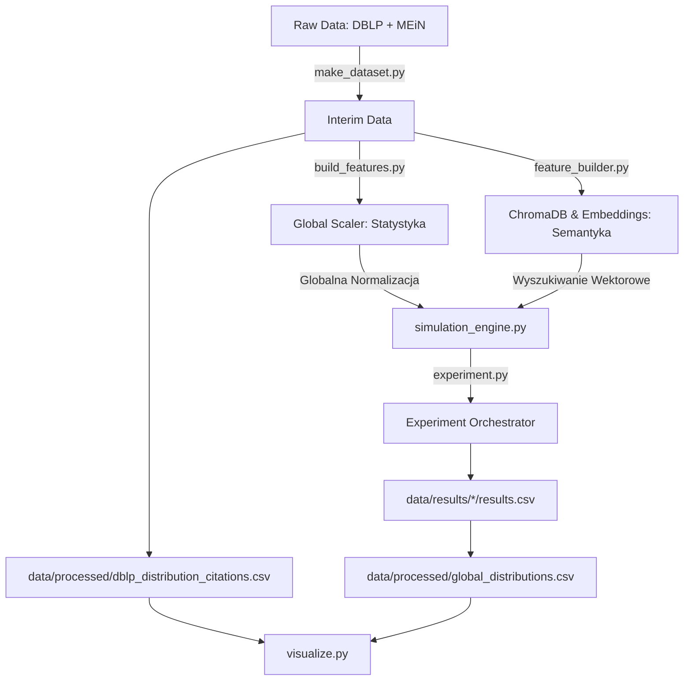

# 📚 Master Thesis: Scientometrics Simulation System (S3)

**Citation Distribution in Scientometric Search Engines**

## Cel pracy magisterskiej

Celem pracy magisterskiej było zaprojektowanie i przeprowadzenie **kontrolowanego eksperymentu symulacyjnego**, który odtwarza działanie wyszukiwarki naukowej (na wzór Google Scholar), umożliwiającej rankingowanie publikacji według różnych strategii oceny, takich jak:

* liczba cytowań,
* data publikacji,
* punktacja ministerialna (MEiN / MNiSW),
* podobieństwo semantyczne zapytania i dokumentu.

Głównym problemem badawczym była analiza **wpływu algorytmów rankingowych i wag sortowania na rozkład cytowań wyników wyszukiwania**, ze szczególnym uwzględnieniem zjawisk *heavy tail* i rozkładów potęgowych (Power Law).

---

## Założenie eksperymentu

W ramach pracy zbudowano **sztuczny agregator publikacji naukowych (Virtual Aggregator)**, który:

* wykorzystuje embeddingi semantyczne zapytań i artykułów,
* symuluje paginację wyników (top-k, top-n),
* pozwala sterować wagami rankingowymi,
* generuje rozkłady cytowań wyników,
* porównuje je z **empirycznym rozkładem DBLP**.

Celem było sprawdzenie, czy i w jakim stopniu mechanizmy wyszukiwania **systematycznie promują wysoko cytowane prace**, nawet bez jawnego użycia liczby cytowań w rankingu.

---

## 🏗 Architektura projektu (Cookiecutter Data Science)

Projekt oparty jest na strukturze *cookiecutter-data-science* i rozdziela logikę danych, modeli oraz analiz.

### Struktura katalogów

```text
master_thesis
├── LICENSE
├── Makefile
├── README.md
├── data
│   ├── raw              ← surowe dane (DBLP JSON, MEiN Excel, słowniki CSV)
│   ├── interim          ← dane po czyszczeniu i transformacjach
│   ├── processed        ← finalne agregaty (rozkłady empiryczne i symulowane)
│   ├── external         ← ustawienia eksperymentów, słowniki, konfiguracje
│   └── results          ← wyniki cząstkowe symulacji
│
├── models
│   └── global_scaler.pkl ← [!] KRYTYCZNY ARTEFAKT (Hard Dependency)
│                          Utrwalony obiekt normalizacji logarytmicznej. 
│                          Niezbędny do poprawnego działania silnika symulacji.
│
├── notebooks            ← analiza testowa i eksploracyjna (TDD)
├── reports
│   └── figures          ← wykresy PDF/CDF, Zipf, Power Law
├── references           ← dokumentacja, opisy metod
├── requirements.txt
├── setup.py
├── src
│   ├── config           ← konfiguracja przestrzeni eksperymentu
│   ├── data             ← ETL i rozkład empiryczny
│   ├── features         ← Inżynieria cech (Statystyczna i Semantyczna)
│   ├── models           ← silnik symulacji i orkiestracja
│   └── visualization    ← analiza statystyczna i wykresy
└── tox.ini

```

---

## 🔄 Workflow eksperymentu

System realizuje **dwie równoległe ścieżki**. Kluczowym aspektem jest rozdział inżynierii cech na statystyczną (budowa Scalera) oraz semantyczną (indeksowanie wektorowe).



---

## 🛠 Szczegółowy opis modułów `src/`

### 0. Konfiguracja Eksperymentu (`src/config/`)

* **`settings_generator.py`**: Definiuje przestrzeń poszukiwań parametrów (Grid Search).
* **Wejście:** Parametry statyczne: listy `page_sizes`, `citation_numbers` (k), wagi rankingowe.
* **Wyjście:** `data/external/settings.pkl` — binarna mapa wszystkich kombinacji parametrów (immutable config).


---

### 1. Inżynieria Danych i Cech (`src/data/` & `src/features/`)

#### `make_dataset.py` (ETL)

* Przygotowanie danych wejściowych oraz budowa punktu odniesienia (ground truth).
* **Wejście:**
  - `data/external/Wykaz_dyscyplin_...xlsx` (punktacja MEiN).
  - `data/external/dblp-ref-10/*.json` (surowe publikacje).


* **Wyjście:** 
  - `data/interim/articles_with_score_df.csv` — ujednolicony zbiór do symulacji.
  - `data/processed/dblp_distribution_citations.csv` — empiryczny rozkład cytowań.

#### `build_features.py` (Inżynieria Cech - Statystyka)

* Przygotowanie statystyczne danych do poprawnego rankingowania.
* **Wejście:** 
  - `data/interim/articles_with_score_df.csv`.
* **Wyjście:** 
  - `models/global_scaler.pkl` — **Global Scaler** (log-skala cytowań).
* **Uzasadnienie techniczne:** 

  Scaler zapobiega „relatywizmowi lokalnemu”. Bez globalnej normalizacji silnik oceniałby popularność tylko w relacji do innych wyników w danym zapytaniu, co uniemożliwiłoby odtworzenie rozkładu Power Law.

#### `feature_builder.py` (Inżynieria Cech - Semantyka)

* Reprezentacja tekstowa i indeksowanie.
* **Wejście:**
  - `data/interim/articles_with_score_df.csv`.
  - `data/raw/*.csv` (słowniki rzeczowników, czasowników itp. do generatora zapytań).


* **Wyjście:** * `data/chroma/` — trwała baza wektorowa.
  - `data/interim/titles_with_embeddings.pkl` — utrwalone wektory artykułów.
  - `data/interim/queries_with_embeddings.pkl` — zestaw zapytań z ich embeddingami.

---

### 2. Modelowanie i Symulacja (`src/models/`)

#### `simulation_engine.py` (Virtual Aggregator)

* Rdzeń implementujący zachowanie wyszukiwarki.
* **Wejście (Zależności):** `models/global_scaler.pkl`, połączenie z `data/chroma/`.
* **Mechanika:** Przekształcenie dystansu na podobieństwo (), skalowanie cech, paginacja  i ważony ranking.

#### `experiment.py` (Orkiestrator)

* Zarządzanie masowym uruchamianiem symulacji.
* **Wejście:** 
  - `data/interim/queries_with_embeddings.pkl`, 
  - `data/external/settings.pkl`.
* **Wyjście:**
  - `data/results/{settings_id}/results.csv` — logi pojedynczych konfiguracji.
  - `data/processed/global_distributions.csv` — zagregowany wynik końcowy.

---

### 3. Wizualizacja i Analiza (`src/visualization/`)

#### `visualize.py`

* Analiza statystyczna i porównawcza.
* **Wejście:** 
  - `data/processed/global_distributions.csv`, 
  - `data/processed/dblp_distribution_citations.csv`.
* **Funkcje:** Testy Kolmogorova–Smirnova, estymacja  i  (biblioteka `powerlaw`), generacja wykresów Zipf.
* **Wyjście:**
  - `reports/figures/full_experiment_report.pdf`.

## 🧪 Notatniki (Test-Driven Analysis)

1. `01_scientometrics_quotes.ipynb` – walidacja danych MEiN
2. `02_scientometrics_search_engine.ipynb` – embeddingi i ChromaDB
3. `03_scientometrics_distribution_experiment.ipynb` – testy silnika
4. `04_scientometrics_data_distribution.ipynb`
5. `05_scientometrics_statistical_aggregation.ipynb`
6. `06_visualization_dashboard.ipynb` – **finalna analiza porównawcza**

---

## ⚖️ Rejestr poprawek logicznych (Changelog)

W trakcie rozwoju silnika `Scientometrics` zidentyfikowano i wyeliminowano błędy krytyczne, które mogły wpływać na statystyczną poprawność generowanych rozkładów cytowań. Szczegółowe opisy zmian znajdują się w poniższych dokumentach:

* **[Poprawka mechanizmu losowania (Index Mismatch) - Page shifting](references/changelog/page_draw.md)**
    * Opis błędu polegającego na przesunięciu indeksów stron podczas losowania bez powtórzeń.
    * Wyjaśnienie nowej logiki mapowania `active_indices`, gwarantującej unikalność artykułów w ramach jednego zapytania.

* **[Gwarancja odtwarzalności (Seed per Query)](references/changelog/seed.md)**
    * Dokumentacja zmiany strategii ustawiania ziarna losowości (seed).
    * Zastosowanie techniki *Seed Offset* ($42 + \text{global\_query\_id}$), zapewniającej unikalną, ale w pełni powtarzalną sekwencję losowań dla każdego zapytania, niezależnie od podziału na batche.

* **[Similarity vs Distance](references/changelog/similarity_logic.md)**
    * ChromaDB domyślnie zwraca distances. W kodzie sortowanie `reverse=True` (malejąco) promowało artykuły z największym dystansem, czyli najmniej podobne. Poprawiono to, przekształcając dystans w miarę podobieństwa: `similarity=1−distance`.

* **[Normalizacja Globalna i Logarytmiczna](references/changelog/global_scaling.md)**:
    * Wyeliminowano problem "relatywizmu lokalnego", w którym lokalny lider popularności (np. 5 cytowań) był oceniany identycznie jak lider globalny (10 000 cytowań). 
    * Wprowadzono transformację logarytmiczną $\log(1+x)$ oraz **Global Scaler** wyuczony na pełnym zbiorze danych (850k+ rekordów). 
    * Zmiana ta zapewnia spójność wyników między batchami oraz poprawną reprezentację rozkładów potęgowych (Power Law), co jest fundamentem rzetelnych badań naukometrycznych.

* **[Korekta metodologii Power Law (Observations vs Frequencies))](references/changelog/statistical_validity.md)**:
    * Wyeliminowano błąd polegający na dopasowywaniu modelu do zagregowanych liczności (częstotliwości) zamiast do surowych wartości cytowań.
    * Skorygowano obliczenia współczynnika α oraz włączono procedurę estymacji progu $x_{min}$​, co umożliwiło poprawne wyznaczenie "ciężkiego ogona" rozkładu (heavy tail) zgodnie ze standardami statystyki matematycznej.

---

## Jak uruchomić eksperyment?

1. **Konfiguracja eksperymentu:**
`python src/config/settings_generator.py`
2. **Przygotowanie danych (ETL):**
`python src/data/make_dataset.py`
3. **Generowanie Scalera (Statystyka):**
`python src/features/build_features.py`
4. **Budowa bazy wektorowej (Semantyka):**
`python src/features/feature_builder.py`
5. **Uruchomienie symulacji:**
`python src/run_experiment.py` (lub przez notatnik `03_...`)
6. **Wizualizacja i analiza:**
Notatnik `06_visualization_dashboard.ipynb` – generacja wykresów PDF/CDF i Zipf plots.
---

## 📦 Wymagania i instalacja

System wymaga Python 3.10+ oraz instalacji poniższych zależności:

```bash
pip install -r requirements.txt
```

**Kluczowe technologie**:
  - **Baza wektorowa**: ChromaDB
  - **NLP**: Sentence-Transformers (PyTorch)
  - **Statystyka**: powerlaw, scipy
  - **Dokumentacja**: Sphinx, sphinx-rtd-theme

---

© 2025 kabix09. Wszystkie prawa zastrzeżone.

